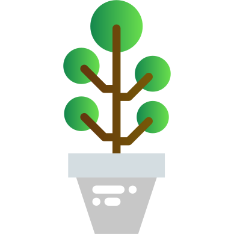
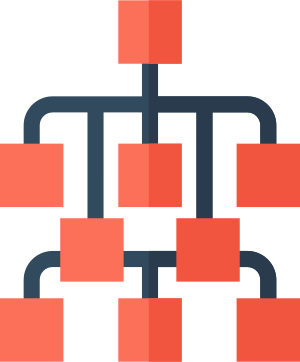
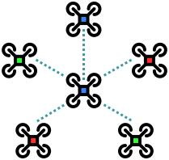

+++

title = "An Aggregate Vascular Morphogenesis Controller for Engingeered Self-Organising Spatial Structures"
description = "Presentation @ACSOS 2024"
outputs = ["Reveal"]

+++

# An Aggregate Vascular Morphogenesis Controller for Engingeered Self-Organising Spatial Structures

[Angela Cortecchia](mailto:angela.cortecchia@unibo.it) <!--<i class="fa-solid fa-computer"></i>-->,
[Danilo Pianini](mailto:danilo.pianini@unibo.it) <!--<i class="fa-solid fa-computer"></i>-->,
[Giovanni Ciatto](mailto:giovanni.ciatto@unibo.it) <!--<i class="fa-solid fa-computer"></i>-->,
and
[Roberto Casadei](mailto:roby.casadei@unibo.it) <!--<i class="fa-solid fa-computer"></i>-->

<!-- <i class="fa-solid fa-computer"></i> Department of Computer Science and Engineering, University of Bologna, Cesena (FC), Italy -->

---




{}
### Plants

{}



{}
### Organizations

{}



{}
### Flocking swarms

{}




{}
# What do they have in common?
{}



---

# The Vascular Morphogenesis Controller





The <b>VMC</b> is a model for the growth of artificial structures over time.

It models tree-like structures, in which every node can get information from the environment.

The leaves of the tree start by sending the amount of <b>success</b> they sense to the root.

The root then sends back an amount of <b>resources</b> based on the success received from the leaves, regulating the tickness of their connections.

<h3 class = "fragment" data-fragment-index="4"><i class="fa-solid fa-arrow-right"></i> But it has some limitations</h3>

<i class="fa-solid fa-triangle-exclamation"></i> VMC assumes that organizations have <b>only</b> a tree structure.

<i class="fa-solid fa-triangle-exclamation"></i>VMC assumes strict <b>synchronous operations</b>.

<i class="fa-solid fa-angles-right"></i>Restricting the model usefulness, leading to <b>abstraction gaps</b>.





  
  
  
  
  




---

# Possible Solution?

An implementation as a **Field-based** computation with the **Aggregate Computing** paradigm!

---

# What is Aggregate Computing?

A macro-programming approach that defines the **collective behavior** of heterogeneous devices in a **self-organizing system**.

Based on Field Calculus abstractions, it operates in terms of *field*: a distributed data structure.

--- 

# The **Aggregate** Vascular Morphogenesis Controller

## Model

---

# The **Aggregate** Vascular Morphogenesis Controller

## Implementation

(roots, regions, flaws)
open source, soon in standard lib -> pattern organizzativi che prima non c'erano
validation made by qualitative approach

---

# The **Aggregate** Vascular Morphogenesis Controller

## distinctive features 
(multiple leaders, growth and shrink, merge and split)

---

# Experiments

gif varie con fragment

---

# Conclusions / future works 

per cosa possiamo usarlo?
