+++

title = "An Aggregate Vascular Morphogenesis Controller for Engingeered Self-Organising Spatial Structures"
description = "Presentation @ACSOS 2024"
outputs = ["Reveal"]

+++

# An Aggregate Vascular Morphogenesis Controller for Engingeered Self-Organising Spatial Structures

[**Angela Cortecchia**](mailto:angela.cortecchia@unibo.it) <!--<i class="fa-solid fa-computer"></i>-->,
[Danilo Pianini](mailto:danilo.pianini@unibo.it) <!--<i class="fa-solid fa-computer"></i>-->,
[Giovanni Ciatto](mailto:giovanni.ciatto@unibo.it) <!--<i class="fa-solid fa-computer"></i>-->,
and
[Roberto Casadei](mailto:roby.casadei@unibo.it) <!--<i class="fa-solid fa-computer"></i>-->

<!-- <i class="fa-solid fa-computer"></i> Department of Computer Science and Engineering, University of Bologna, Cesena (FC), Italy -->

---




{}
### Plants

{}



{}
### Organizations

{}



{}
### Flocking swarms

{}




{}
# What do they have in common?
{}



---

# The Vascular Morphogenesis Controller 





The <b>VMC</b><small>[1]</small> is a model for the growth of artificial structures over time.

It models <b>tree-like structures</b>, in which every node can get information from the environment.

The leaves of the tree start by sending the amount of <b>success</b> they sense to the root.

The root then sends back an amount of <b>resources</b> based on the success received from the leaves, regulating the tickness of their connections.

<h3 class = "fragment" data-fragment-index="4"><i class="fa-solid fa-arrow-right"></i> But it has some limitations</h3>

<i class="fa-solid fa-triangle-exclamation"></i>VMC assumes strict <b>synchronous operations</b>.

<i class="fa-solid fa-triangle-exclamation"></i> VMC assumes that organizations have <b>only</b> a tree structure.

<!-- 
<i class="fa-solid fa-angles-right"></i>Could restricts the model usefulness, leading to <b>abstraction gaps</b>.
 -->




  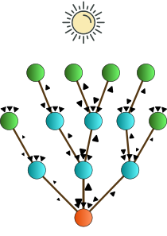
  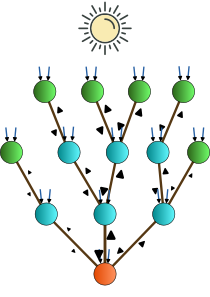
  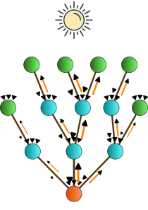
  
  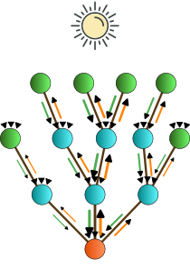
  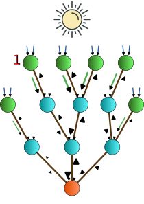
  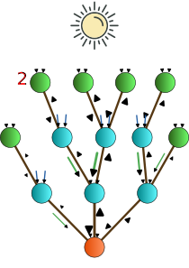
  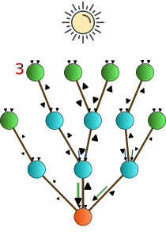
  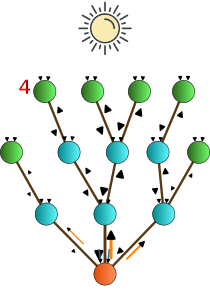
  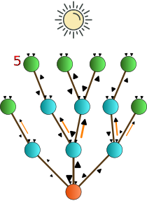
  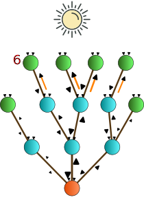
  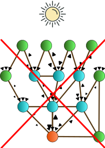
  <!--  -->




<small style="text-align: left"> 

[1] Zahadat, P., Hofstadler, D.N., Schmickl, T. "Morphogenesis as a Collective Decision of Agents Competing for Limited Resource: A Plants Approach." 2018.

</small>

---

# A Possible Solution?

An implementation as a **Field-based**<small>[2]</small> computation with the **Aggregate Computing**<small>[3]</small> paradigm!

<small style="text-align: left"> 
[2] Viroli, M., Beal, J., Damiani, F., Audrito, G., Casadei, R., Pianini, D. "From distributed coordination to field calculus and aggregate computing." 2019. 
[3] Beal, J., Pianini, D., Viroli, M. "Aggregate Programming for the Internet of Things." 2015.
</small> 

---

# What is Aggregate Computing?

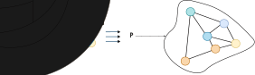

A macro-programming approach that defines the **collective behavior** of heterogeneous devices in a **self-organizing system**.

Based on Field Calculus abstractions, it operates in terms of *field*: a distributed data structure.

--- 

# The **Aggregate** Vascular Morphogenesis Controller

## Model





A node represents an <b>agent</b>.

A neighboring link denotes the possibility of two agents to <b>communicate</b>.

Each agent is assumed to have <b>sensors</b>: <em>success, resource, position and distance.</em>

And <b>actuators</b>: <em>spawning and destroying.</em>





  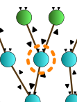
  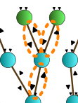
  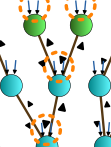
  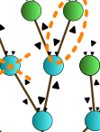




---

# The **Aggregate** Vascular Morphogenesis Controller

## Implementation



{}

Structures as <b>graphs</b> are supported. 

Use of _self-organizing coordination regions_<small>[4]</small> pattern to define the forward and backward flows of resources and success.

Given a network of devices, the <b>SCR</b> pattern performs <b>simultaneously</b> four steps:

<ol>
  <li class="fragment" data-fragment-index="1">Elects sparse <b>leaders</b> among candidates;</li>
  <li class="fragment" data-fragment-index="3">Evolves <b>regions</b> from leaders;</li>
  <li class="fragment" data-fragment-index="4">Creates <b>upstream</b> information <b>flows</b> towards the leader;</li>
  <li class="fragment" data-fragment-index="5">Performs <b>decision-making</b> at the leader and <b>downstream decisions</b>.</li>
</ol>

Hence supporting <b>multiple trees</b> and a <b>dynamic</b>, <b>resilient set of trees</b>.

{}

{}

  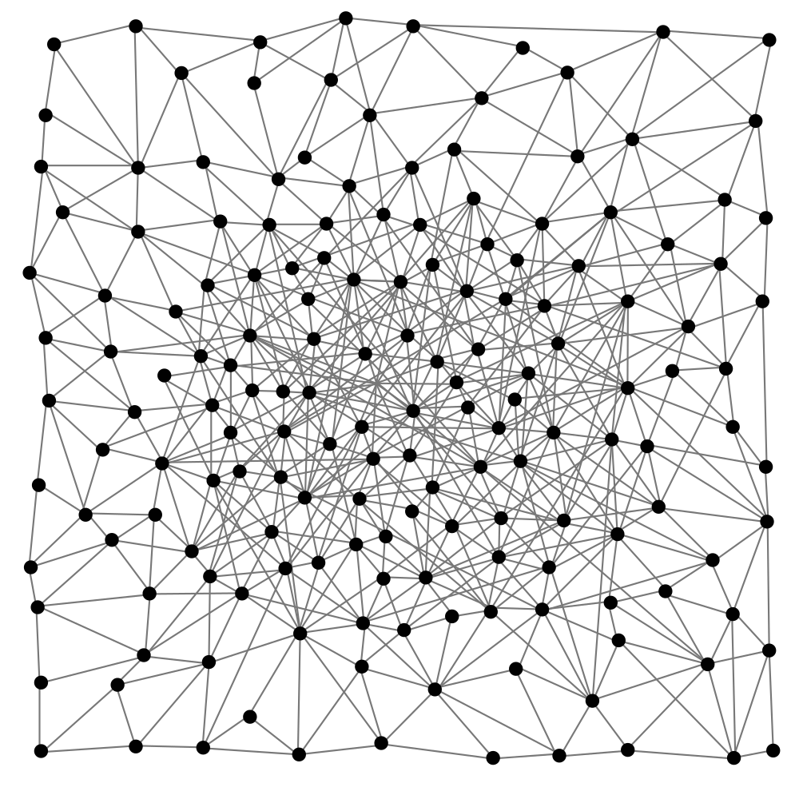
  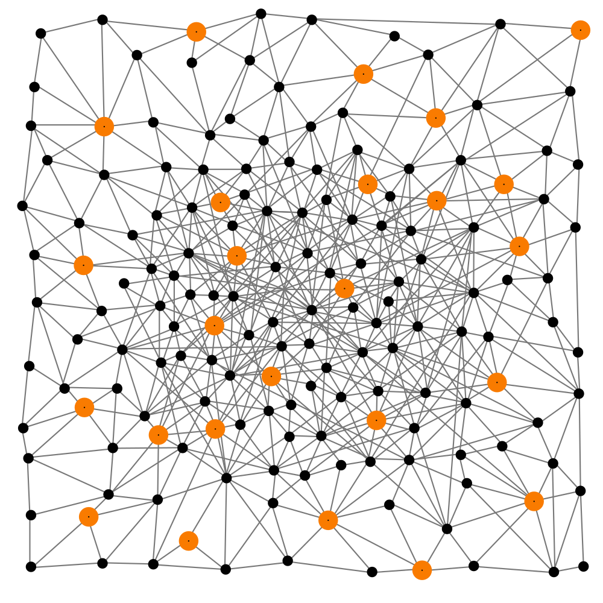
  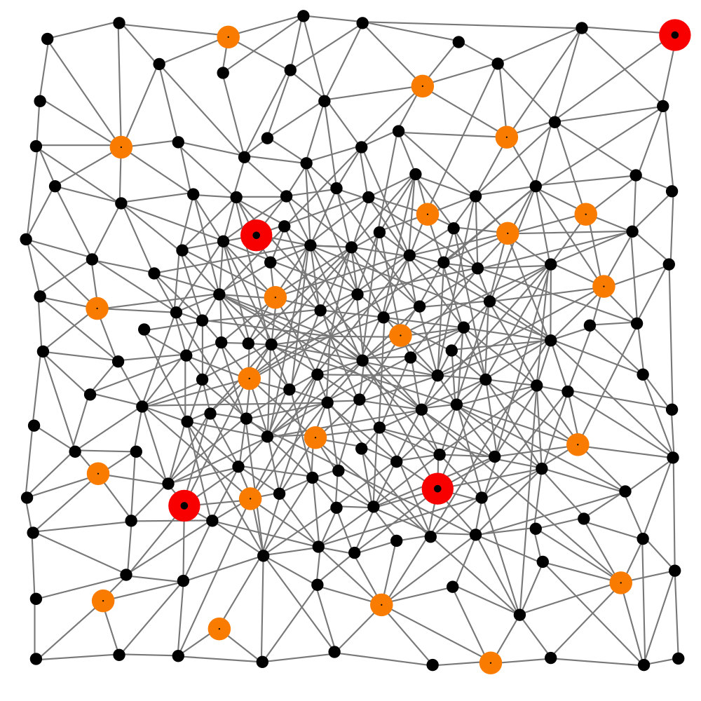
  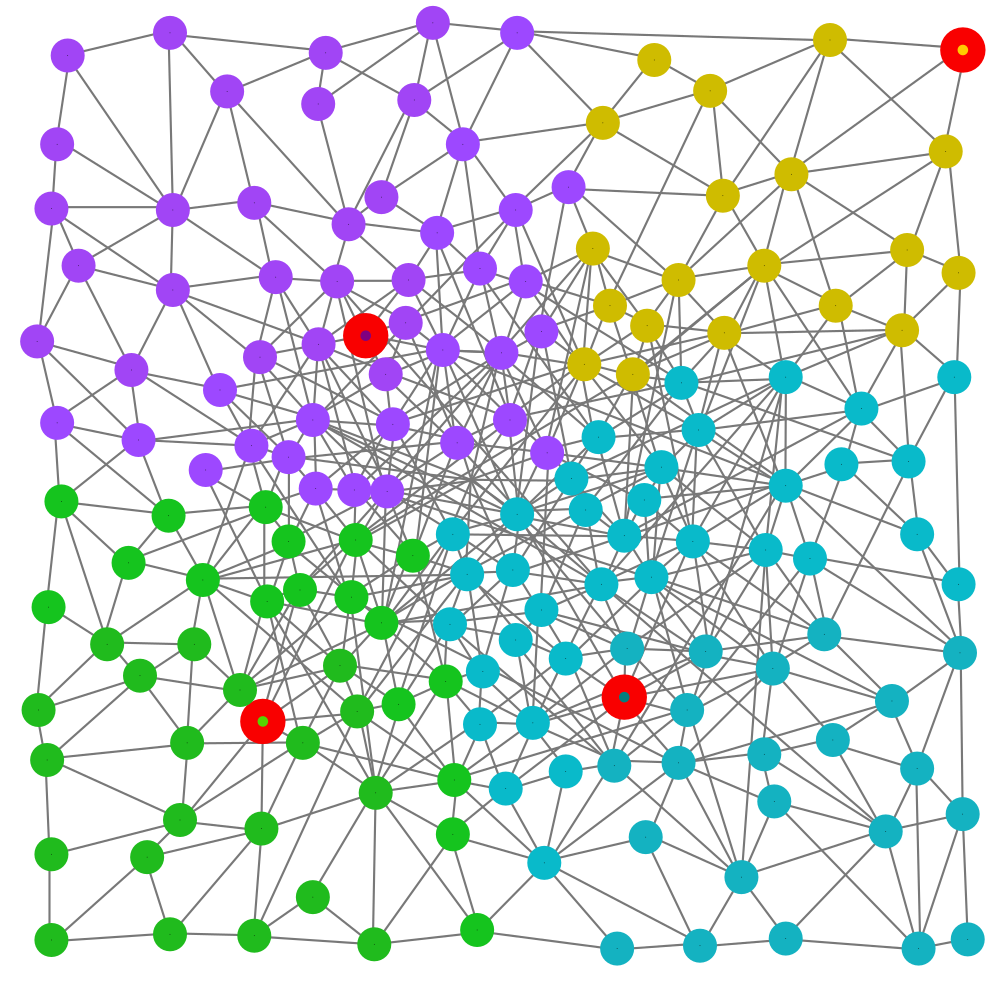
    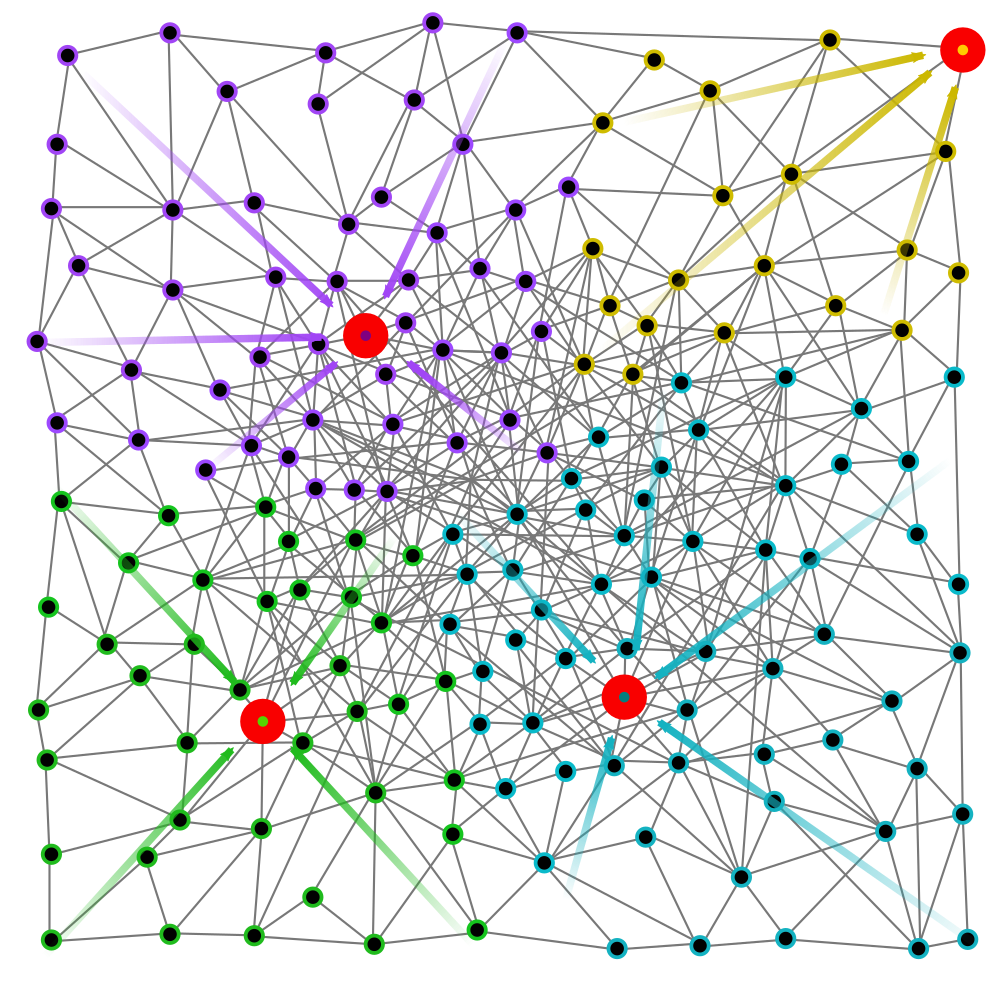
    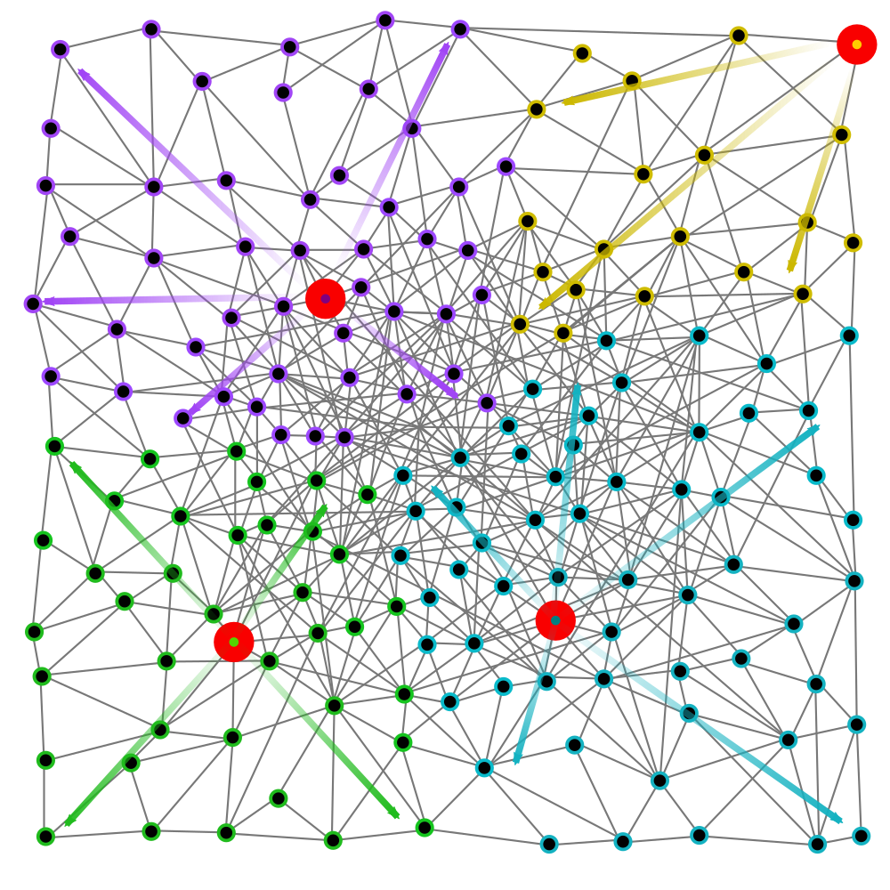
  

{}



<small style="text-align: left"> 
[4] Casadei, R., Pianini, D., Viroli, M., Natali, A. "Self-organising Coordination Regions: A Pattern for Edge Computing." 2019.
</small> 

<!-- SCR addresses problem decomposition and task assignment in distributed settings by: (i) electing sparse lead- ers; (ii) evolving regions from leaders; (iii) creating upstream information flows [14] towards the leader; (iv) performing decision-making at the leader and downstreaming decisions. -->

<!-- (roots, regions, flaws) -->
<!-- open source, soon in standard lib -> pattern organizzativi che prima non c'erano -->
<!-- validation made by qualitative approach -->

---

# The **Aggregate** Vascular Morphogenesis Controller

## Supported features 

<ul style="margin-left: 3em; margin-right: 3em;">
  <li class="fragment" data-fragment-index="1"><strong>Multiple leaders</strong>: allowing easier management of large network by splitting them in sub-systems;</li>
  <li class="fragment" data-fragment-index="2"><strong>Growth and shrink</strong>: different implementations of <em>spawning/destroying</em> strategies can lead to different structures. 
  <li class="fragment" data-fragment-index="3"><strong>Merge and split</strong>: ihnerits <em>self-organizing</em> capabilities from AC, thus supports network segmentation or merging.</li>
</ul>

--- 

# Application example: **Germination**



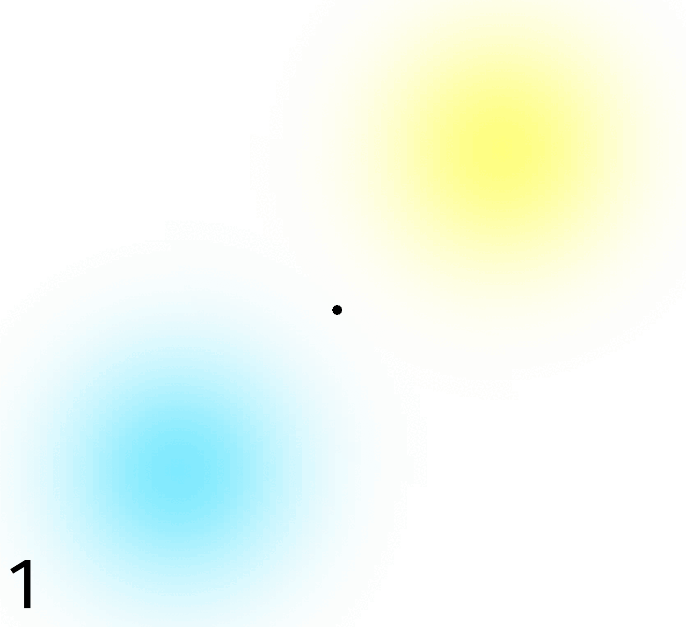


{}
## Self-Construction
Starts from a single node **with** spawning and destroying policies.

The first node self-elects as root and spawns new nodes. 
When a new one is in a better position, it gets elected as root. 

In this way the system goes towards better resources.

Then the system expands towards the success source as much as possible,
and stabilizes.

{}



---

# Application example: **cutting**






{}
## Self-Repairing

Starts from a network filled with nodes able to communicate with others within a specific range,
**without** spawn or destroy policies.

The structure elects a leader, that results to be the one nearest the resources source.

Once the system has stabilized, all the nodes at the center of the structure are removed, 
creating two different non-communicating sub-systems.

Then the two sub-systems restabilize independently.

{}



---

# Application example: **Grafting**






{}
## Self-Integration

Starts from two non-communicating systems, **without** spawn and destroy policies.

After the two systems have stabilized, 
they are merged.

A new system is created, with the resources shared among the nodes differently.

{}



---

# Application example: **Budding**






{}
## Self-Segmentation

Starts from two non-communicating systems **without** spawn and destroy policies.

The influence radius of a leader is reduced, 
in a way each system **elects more than one leader**, 
therefore **dividing itself into subregions**.

After their stabilization, 
the two systems are merged,
and the subregions change based on their potential new leaders.

{}



---

# Application example: **Abscission and regrowth**






{}
## Self-Optimization

Starts from two non-communicating substructures **with** spawn and destroy policies.

Firstly, the two substructures are optimized, 
then they get connected due to the spawning of new nodes.

The new global structure reshapes, 
optimizing the balance between resources and success.
{}



---

# Conclusions 

The approach enables to express morphogenetic algorithm by a **macroscopic perspective** via aggregate computing.

Possible future directions:

- Inspect more **dynamics** and **complex organizational scenarios**;
- Development of a **software library** of _aggregate morphogenetic blocks_;
- Investigate the system response to **continuous perturbations**;
- Apply this approach to **real-world scenarios**.

---

## Reproducible examples here!

