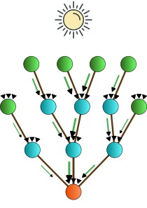
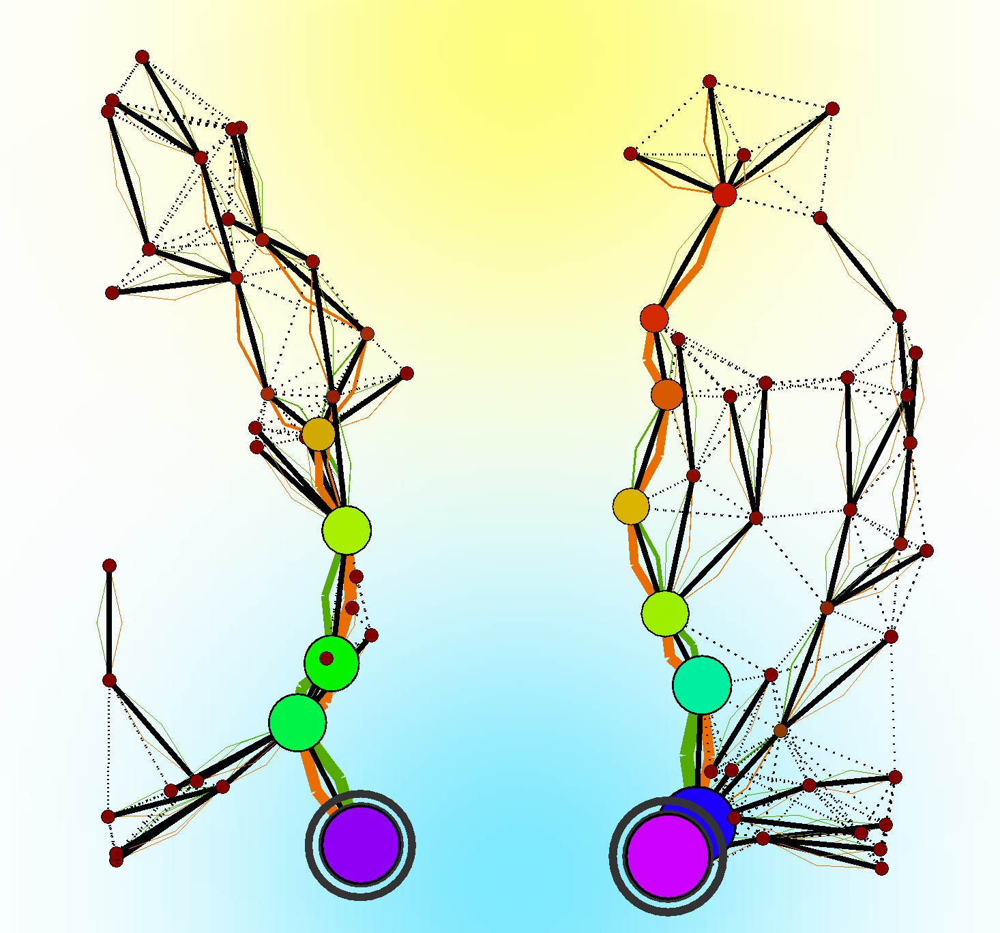

+++

title = "An Aggregate Vascular Morphogenesis Controller for Engingeered Self-Organising Spatial Structures"
description = "Presentation @ACSOS 2024"
outputs = ["Reveal"]

+++

# An Aggregate Vascular Morphogenesis Controller for Engingeered Self-Organising Spatial Structures

[**Angela Cortecchia**](mailto:angela.cortecchia@unibo.it) <!--<i class="fa-solid fa-computer"></i>-->,
[Danilo Pianini](mailto:danilo.pianini@unibo.it) <!--<i class="fa-solid fa-computer"></i>-->,
[Giovanni Ciatto](mailto:giovanni.ciatto@unibo.it) <!--<i class="fa-solid fa-computer"></i>-->,
and
[Roberto Casadei](mailto:roby.casadei@unibo.it) <!--<i class="fa-solid fa-computer"></i>-->

<!-- <i class="fa-solid fa-computer"></i> Department of Computer Science and Engineering, University of Bologna, Cesena (FC), Italy -->

---



{}

### Plants

{}


{}
### Organizations

{}



{}
### Flocking swarms

{}




{}
# What do they have in common?
{}



---

# Vascular Morphogenesis Controller (**VMC**)<small>[1]</small>





A model for the growth of artificial structures over time.

Works on <b>tree-like structures</b>, in which every node can get information from the environment.

The leaves of the tree start by sending the amount of <b>success</b> they sense to the root.

The root sends back an amount of <b>resources</b> based on the success received from the leaves, regulating the tickness of their connections.

<h3 class = "fragment" data-fragment-index="4"><i class="fa-solid fa-arrow-right"></i> Limitations</h3>

<i class="fa-solid fa-triangle-exclamation"></i><b> Implicitly synchronous</b>.

<i class="fa-solid fa-triangle-exclamation"></i> Requires an <b> underlying tree structure</b> (can't work on graphs).

<!-- 
<i class="fa-solid fa-angles-right"></i>Could restricts the model usefulness, leading to <b>abstraction gaps</b>.
 -->




  
  
  
  
  
  
  
  
  
  
  
  




<small style="text-align: left">

[1] Zahadat, P., Hofstadler, D.N., Schmickl, T. "Morphogenesis as a Collective Decision of Agents Competing for Limited Resource: A Plants Approach." 2018.

</small>

---

# A Possible Solution

Porting VMC into a framework that by-design:
1. supports **graph structures** and
2. features **asynchronous** computations.

{}
If the implementation is feasible,
it will automatically overcome the limitations of the original model.
{}

---

# Meet Aggregate Computing<small>[2]</small>

A macro-programming approach that defines the **collective behavior** of heterogeneous devices in a **self-organizing system**.

Based on the **Field Calculus**<small>[3]</small>, operates by manipulating distributed data structures called *fields*.

<small style="text-align: left">
[2] Beal, J., Pianini, D., Viroli, M. "Aggregate Programming for the Internet of Things." 2015. 
[3] Audrito, G., Viroli, M., Damiani, F., Pianini, D., Beal, J. "A Higher-Order Calculus of Computational Fields." 2019.
</small>

---

# `FieldVMC`: **Aggregate Computing**-based VMC

## Model





Nodes can <b>compute</b>.

Neighboring nodes can <b>communicate</b>.

Nodes have <b>sensors</b>: <em>success, resource, distance, and optionally position.</em>

Nodes have optional <b>actuators</b>: <em>spawning and destroying.</em>





  
  
  
  




---

# `FieldVMC`: **Aggregate Computing**-based VMC

## Implementation



{}

(multiple) **Trees** are built on top of **arbitrary networks** using
the _self-organizing coordination regions_ (SCR)<small>[4]</small> pattern.

<b>SCR</b> performs <b>continuously</b>:

<ol>
  <li class="fragment" data-fragment-index="1">Sparse <b>leader election</b>;</li>
  <li class="fragment" data-fragment-index="3"><b>Control region expansion</b> from leaders;</li>
  <li class="fragment" data-fragment-index="4"><b>Upstream</b> information <b>flows</b> construction;</li>
  <li class="fragment" data-fragment-index="5"><b>Decision-making</b> and <b>downstream propagation</b>.</li>
</ol>

{}

{}

  
  
  
  
    
    

{}



<small style="text-align: left">
[4] Casadei, R., Pianini, D., Viroli, M., Natali, A. "Self-organising Coordination Regions: A Pattern for Edge Computing." 2019.
</small>

<!-- SCR addresses problem decomposition and task assignment in distributed settings by: (i) electing sparse lead- ers; (ii) evolving regions from leaders; (iii) creating upstream information flows [14] towards the leader; (iv) performing decision-making at the leader and downstreaming decisions. -->

<!-- (roots, regions, flaws) -->
<!-- open source, soon in standard lib -> pattern organizzativi che prima non c'erano -->
<!-- validation made by qualitative approach -->

---

# `FieldVMC`: **Aggregate Computing**-based VMC

<!--  -->

<!--  -->
<h2>How it works</h2>
<ol>
  <li><strong>Leader</strong>(s) are chosen <strong>dynamically</strong> based on resource availability;</li>
  <li class="fragment" data-fragment-index="1">A <strong>gradient field</strong> defines zones around each leader, organized by distance to their nearest leader;</li>
  <li class="fragment" data-fragment-index="2"><strong>Nodes send data to their leader</strong>, forming a hierarchical tree;</li>
  <li class="fragment" data-fragment-index="3">Leaders <strong>distribute resources</strong> based on node performance;</li>
  <li class="fragment" data-fragment-index="4">Nodes <strong>act based on resources and success</strong>, spawning new nodes or self-destructing.</li>
</ol>
<!--  -->

<!--  -->
<h3 class="fragment" data-fragment-index="5"> Supported features</h3>

<ul>
  <li class="fragment" data-fragment-index="6"><strong>Multiple leaders</strong>: allowing easier management of large network by splitting them in sub-systems;</li>
  <li class="fragment" data-fragment-index="7"><strong>Growth and shrink</strong>: different implementations of <em>spawning/destroying</em> strategies can lead to different structures. 
  <li class="fragment" data-fragment-index="8"><strong>Merge and split</strong>: ihnerits <em>self-organizing</em> capabilities from AC, thus supports network segmentation or merging.</li>
</ul>
<!-- 
{}
{}
{} -->
<!--  -->

<!--  -->

---

# Application example: **Germination**




  



{}
## Self-Construction
Creates a stable structure starting from a single node.

{}



---

# Application example: **cutting**




  



{}
## Self-Repairing

Stabilization in two different structures starting from a damaged one.

<!-- Starts from a network filled with nodes able to communicate with others within a specific range, -->
<!-- **without** spawn or destroy policies. -->

<!-- The structure elects a leader, that results to be the one nearest the resources source. -->

<!-- Once the system has stabilized, all the nodes at the center of the structure are removed, -->
<!-- creating two different non-communicating sub-systems. -->

<!-- Then the two sub-systems restabilize independently. -->

{}



---

# Application example: **Grafting**




  



{}
## Self-Integration

Merging of two different structures into a single one.

<!-- Starts from two non-communicating systems, **without** spawn and destroy policies. -->

<!-- After the two systems have stabilized, -->
<!-- they are merged. -->

<!-- A new system is created, with the resources shared among the nodes differently. -->

{}



---

# Application example: **Budding**




  



{}
## Self-Segmentation

Multiple independent subsystems from a single one.

{}



---

# Application example: **Abscission and regrowth**



  



{}
## Self-Optimization

Optimized merging of two different structures.

<!-- Starts from two non-communicating substructures **with** spawn and destroy policies. -->

<!-- Firstly, the two substructures are optimized, -->
<!-- then they get connected due to the spawning of new nodes. -->

<!-- The new global structure reshapes, -->
<!-- optimizing the balance between resources and success. -->
{}



---

# Conclusion & Future works

The approach enables to express morphogenetic algorithm by a **macroscopic perspective** via aggregate computing.

Possible **future directions**:

- Inspect more **dynamics** and **complex organizational scenarios**;
- Investigate the system response to **continuous perturbations**;
- Development of a **software library** of _aggregate morphogenetic blocks_.

---

## Reproducible experiments here!

<i class="fab fa-github mr-3" style="color: #22373b;"></i> <a href="https://github.com/angelacorte/vmc-experiments">angelacorte/vmc-experiments</a>

