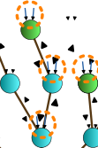

+++

title = "An Aggregate Vascular Morphogenesis Controller for Engingeered Self-Organising Spatial Structures"
description = "Presentation @ACSOS 2024"
outputs = ["Reveal"]

+++

# An Aggregate Vascular Morphogenesis Controller for Engingeered Self-Organising Spatial Structures

[**Angela Cortecchia**](mailto:angela.cortecchia@unibo.it) <!--<i class="fa-solid fa-computer"></i>-->,
[Danilo Pianini](mailto:danilo.pianini@unibo.it) <!--<i class="fa-solid fa-computer"></i>-->,
[Giovanni Ciatto](mailto:giovanni.ciatto@unibo.it) <!--<i class="fa-solid fa-computer"></i>-->,
and
[Roberto Casadei](mailto:roby.casadei@unibo.it) <!--<i class="fa-solid fa-computer"></i>-->

<!-- <i class="fa-solid fa-computer"></i> Department of Computer Science and Engineering, University of Bologna, Cesena (FC), Italy -->

---




{}
### Plants

{}



{}
### Organizations

{}



{}
### Flocking swarms

{}




{}
# What do they have in common?
{}



---

# The Vascular Morphogenesis Controller





The <b>VMC</b> is a model for the growth of artificial structures over time.

It models tree-like structures, in which every node can <b>get information from the environment</b>.

The leaves of the tree start by sending the amount of <b>success</b> they sense to the root.

The root then sends back an amount of <b>resources</b> based on the success received from the leaves, regulating the tickness of their connections.

<h3 class = "fragment" data-fragment-index="4"><i class="fa-solid fa-arrow-right"></i> But it has some limitations</h3>

<i class="fa-solid fa-triangle-exclamation"></i>VMC assumes strict <b>synchronous operations</b>.

<i class="fa-solid fa-triangle-exclamation"></i> VMC assumes that organizations have <b>only</b> a tree structure.

<i class="fa-solid fa-angles-right"></i>Could restricts the model usefulness, leading to <b>abstraction gaps</b>.





  
  
  
  
  
  
  
  
  
  
  
  
  




---

# A Possible Solution?

An implementation as a **Field-based** computation with the **Aggregate Computing** paradigm!

---

# What is Aggregate Computing?

A macro-programming approach that defines the **collective behavior** of heterogeneous devices in a **self-organizing system**.

Based on Field Calculus abstractions, it operates in terms of *field*: a distributed data structure.

--- 

# The **Aggregate** Vascular Morphogenesis Controller

## Model





A node represents an <b>agent</b>.

A neighboring link denotes the possibility of two agents to <b>communicate</b>.

Each agent is assumed to have <b>sensors</b>: <em>success, resource, position and distance.</em>

And <b>actuators</b>: <em>spawning and destroying.</em>





  
  
  
  




---

# The **Aggregate** Vascular Morphogenesis Controller

## Implementation



{}

Structures as <b>graphs</b> are supported. 

To define the forward and backward flows of resources and success, we used the _self-organizing coordination regions_ pattern, hence supporting <b>multiple trees</b> and a <b>dynamic</b>, <b>resilient set of trees</b>.

Given a network of devices, the <b>SCR</b> pattern performs simultaneously four steps:

<ol>
  <li class="fragment" data-fragment-index="1">Elects sparse <b>leaders</b> among candidates;</li>
  <li class="fragment" data-fragment-index="3">Evolves <b>regions</b> from leaders;</li>
  <li class="fragment" data-fragment-index="4">Creates <b>upstream</b> information <b>flows</b> towards the leader;</li>
  <li class="fragment" data-fragment-index="5">Performs <b>decision-making</b> at the leader and <b>downstream decisions</b>.</li>
</ol>

{}

{}

  
  
  
  
    
    

{}



<!-- SCR addresses problem decomposition and task assignment in distributed settings by: (i) electing sparse lead- ers; (ii) evolving regions from leaders; (iii) creating upstream information flows [14] towards the leader; (iv) performing decision-making at the leader and downstreaming decisions. -->

<!-- (roots, regions, flaws) -->
<!-- open source, soon in standard lib -> pattern organizzativi che prima non c'erano -->
<!-- validation made by qualitative approach -->

---

# The **Aggregate** Vascular Morphogenesis Controller

## distinctive features 
(multiple leaders, growth and shrink, merge and split)

--- 

# Self-Construction






{}
Some text here
{}



---

# Self-Repairing






{}
Some text here
{}



---

# Self-Integration






{}
Some text here
{}



---

# Self-Optimization






{}
fixa la gif che ha le immagini sbagliate
{}



---

# Self-Segmentation






{}
Some text here
{}



---

# Conclusions / future works 

per cosa possiamo usarlo?
